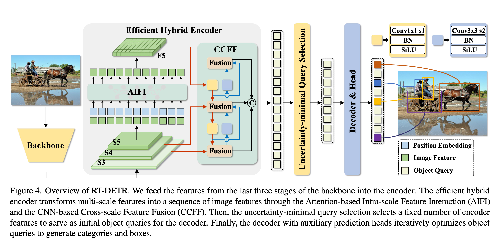
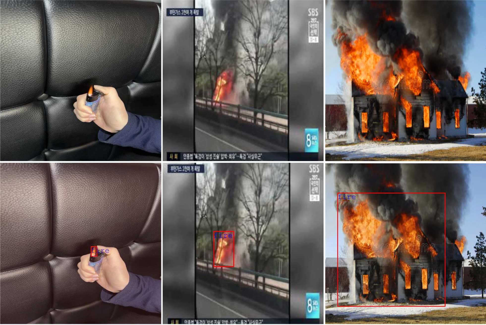

<div align="center"> 
<h1>RT-DETR for Fire Detection <h1>
</div>

[Original document about RT-DETR](README_.md)｜
This project was conducted within the `rtdetr_pytorch` folder.

Dataset｜[BaiDuDisk](https://pan.baidu.com/s/1sFQ_ZrA2X5Bz1rOKMaAygw?pwd=tbbd) | [Weight](https://pan.baidu.com/s/1y0NkJ6m2sHxgR45dSY4fPg?pwd=kyjz) 

https://universe.roboflow.com/xijunlu/fire-syvwe-grojj


## Framework
<div align="center"> 



</div>

## Visualization
<div align="center"> 



</div>

## Results
```Bash
#log
best_stat:  {'epoch': 70, 'coco_eval_bbox': 0.6177822735027276}
```

<div align="center"> 

| **Metric** | **IoU** | **Area** | **maxDets** | **Value** |
|-----------|---------|----------|-------------|-----------|
| AP        | 0.50:0.95 | all      | 100         | 0.617     |
| AP        | 0.50      | all      | 100         | 0.865     |
| AP        | 0.75      | all      | 100         | 0.636     |
| AP        | 0.50:0.95 | small    | 100         | 0.165     |
| AP        | 0.50:0.95 | medium   | 100         | 0.476     |
| AP        | 0.50:0.95 | large    | 100         | 0.730     |
| AR        | 0.50:0.95 | all      | 1           | 0.480     |
| AR        | 0.50:0.95 | all      | 10          | 0.684     |
| AR        | 0.50:0.95 | all      | 100         | 0.742     |
| AR        | 0.50:0.95 | small    | 100         | 0.418     |
| AR        | 0.50:0.95 | medium   | 100         | 0.661     |
| AR        | 0.50:0.95 | large    | 100         | 0.828     |

</div>

> **Definitions**:
> - **AP**: Average Precision
> - **AR**: Average Recall
> - **IoU**: Intersection over Union threshold range
> - **Area**: Object size category
> - **maxDets**: Maximum number of detections per
image

## Citation

```Bash
@misc{lv2023detrs,
      title={DETRs Beat YOLOs on Real-time Object Detection},
      author={Yian Zhao and Wenyu Lv and Shangliang Xu and Jinman Wei and Guanzhong Wang and Qingqing Dang and Yi Liu and Jie Chen},
      year={2023},
      eprint={2304.08069},
      archivePrefix={arXiv},
      primaryClass={cs.CV}
}

@misc{lv2024rtdetrv2improvedbaselinebagoffreebies,
      title={RT-DETRv2: Improved Baseline with Bag-of-Freebies for Real-Time Detection Transformer}, 
      author={Wenyu Lv and Yian Zhao and Qinyao Chang and Kui Huang and Guanzhong Wang and Yi Liu},
      year={2024},
      eprint={2407.17140},
      archivePrefix={arXiv},
      primaryClass={cs.CV},
      url={https://arxiv.org/abs/2407.17140}, 
}

@misc{
    fire-syvwe-grojj_dataset,
    title = { fire Dataset },
    type = { Open Source Dataset },
    author = { Xijunlu },
    howpublished = { \url{ https://universe.roboflow.com/xijunlu/fire-syvwe-grojj } },
    url = { https://universe.roboflow.com/xijunlu/fire-syvwe-grojj },
    journal = { Roboflow Universe },
    publisher = { Roboflow },
    year = { 2025 },
    month = { sep },
    note = { visited on 2025-09-02 },
    }

```

## Acknowledgement

* This code is adapted from [RT-DETR](https://zhao-yian.github.io/RTDETR/).
* We thank Yian Zhao, Wenyu Lv, Shangliang Xu, Jinman Wei, Guanzhong Wang, Qingqing Dang, Yi Liu, Jie Chen for their elegant and efficient code base.